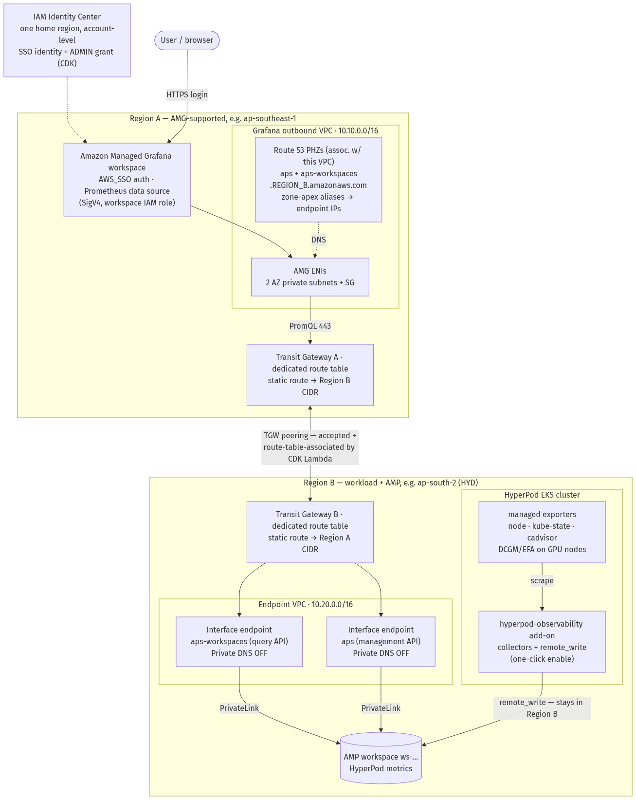

# Cross-Region Observability for SageMaker HyperPod

Connect **Amazon Managed Grafana (AMG)** in one AWS Region to your **SageMaker
HyperPod** cluster's metrics — stored in **Amazon Managed Service for
Prometheus (AMP)** — in a *different* Region, privately, over **Transit Gateway
peering + AWS PrivateLink + Route 53 private hosted zones**. No traffic
traverses the public internet.

The common driver: your HyperPod cluster runs in a Region where AMG is not
offered (for example `ap-south-2` / Hyderabad), so the Grafana workspace must
live elsewhere while the metrics stay local to the cluster.

This guide assumes **HyperPod-integrated observability** — the
`amazon-sagemaker-hyperpod-observability` EKS add-on provisions the AMP
workspace and all collectors with a single console action, so Part 1 is about
ten minutes with no Helm, `kubectl`, or IAM plumbing. If that add-on has not
yet rolled out to your metrics Region, you will need to set up AMP collection
manually instead (see the note in [Enable Observability](./01-enable-observability.md)).

## Architecture



Solid arrows are the **query path** (Grafana → AMP) and the **ingest path**
(cluster → AMP); dotted arrows are DNS resolution and identity. Two facts worth
internalizing:

- **Metric ingestion never leaves Region B.** The cluster and AMP are in the
  same Region, so `remote_write` stays local. Only **PromQL queries** (and
  their small result sets) cross Regions — which is why the cross-region data
  transfer cost is negligible.
- **Nothing touches the public internet.** Query traffic rides the Transit
  Gateway peering (AWS backbone) into PrivateLink interface endpoints.

## What you deploy

| Part | What | How | Time |
|---|---|---|---|
| 1 | AMP workspace + metric collection in Region B | HyperPod console (one click) | ~10 min |
| 2 | VPC/TGW/PrivateLink/DNS + AMG workspace + data source | AWS CDK (three stacks) | ~40 min |
| — | Validation + dashboards | script + browser | ~10 min |

## Regions in this guide

Throughout, **Region A** is the AMG Region (must be an
[AMG-supported Region](https://docs.aws.amazon.com/general/latest/gr/grafana-service.html))
and **Region B** is the HyperPod + AMP Region. Examples use
`ap-southeast-1` (Singapore) for A and `ap-south-2` (Hyderabad) for B.

## Set your environment once

Every command in this guide reads these shell variables. Set them in one
terminal and stay in it (or persist them with the `env | grep ... > ~/amg-env.sh`
line and `source` them in new terminals).

```bash
export REGION_A=ap-southeast-1          # AMG Region (must be AMG-supported)
export REGION_B=ap-south-2              # Region with HyperPod
export HP_CLUSTER=my-hyperpod-cluster   # HyperPod cluster name (as shown in the console)
export ACCOUNT=$(aws sts get-caller-identity --query Account --output text)

# derived: the EKS cluster behind the HyperPod cluster
export EKS_ARN=$(aws sagemaker describe-cluster --cluster-name "$HP_CLUSTER" \
  --region "$REGION_B" --query 'Orchestrator.Eks.ClusterArn' --output text)
export EKS_CLUSTER=${EKS_ARN##*/}

# after Part 1 you will also set:   export WS_ID=ws-...
# after the prerequisites below:    export ADMIN_GUID=...

# optional: persist for new terminals
env | grep -E '^(REGION_|EKS_|HP_|ACCOUNT|WS_ID|ADMIN_|SSO_)' > ~/amg-env.sh
```

## Prerequisites

| Requirement | Why | How to check |
|---|---|---|
| **IAM Identity Center enabled** in the account | AMG UI login supports only Identity Center or SAML; this cannot be automated (it is an account/org-level bootstrap) | Console → IAM Identity Center. It lives in exactly **one home Region** — check there, not necessarily your working Region |
| An Identity Center **user** and its **User ID (GUID)** | The CDK grants that user workspace ADMIN by GUID | Console: IAM Identity Center → **Users** → your user → copy the **User ID** field (e.g. `54c84408-d041-707f-...`), then `export ADMIN_GUID=<value>` |
| **Region B opted in** (if it is an opt-in Region such as `ap-south-2`) | Nothing deploys there otherwise; TGW peering acceptance also requires opt-in | Console → Account → Regions |
| **VPC quota headroom** in both Regions (at least one free VPC each) | Each stack creates one VPC per Region | `for r in $REGION_A $REGION_B; do echo "$r: $(aws ec2 describe-vpcs --region $r --query 'length(Vpcs)' --output text)"; done` vs. quota (default 5). A full Region fails deploy with "maximum number of VPCs has been reached" |
| **HyperPod observability add-on available** in Region B | Part 1 depends on it; regional rollout is gradual | `aws eks describe-addon-versions --region $REGION_B --addon-name amazon-sagemaker-hyperpod-observability --query 'addons[].addonVersions[0].addonVersion' --output text` — a version string means supported; empty means use the manual fallback |

### Resolving your Identity Center User ID by CLI

If you prefer not to click through the console (and your principal has
`sso:ListInstances` + `identitystore:GetUserId`):

```bash
export SSO_USERNAME=<your-identity-center-username>
export SSO_HOME=$(for r in $(aws ec2 describe-regions --query 'Regions[].RegionName' --output text); do \
  aws sso-admin list-instances --region "$r" --query 'Instances[0].InstanceArn' --output text 2>/dev/null \
  | grep -q arn && echo "$r" && break; done)
export STORE_ID=$(aws sso-admin list-instances --region "$SSO_HOME" \
  --query 'Instances[0].IdentityStoreId' --output text)
export ADMIN_GUID=$(aws identitystore get-user-id --region "$SSO_HOME" \
  --identity-store-id "$STORE_ID" \
  --alternate-identifier '{"UniqueAttribute":{"AttributePath":"userName","AttributeValue":"'"$SSO_USERNAME"'"}}' \
  --query UserId --output text)
echo "$ADMIN_GUID"
```

### Tools on your workstation

```bash
node --version          # >= 18, required by the CDK CLI
python3 --version       # >= 3.9, required by the CDK app
npm install -g aws-cdk  # installs the `cdk` CLI
aws sts get-caller-identity   # AWS CLI v2, configured with the deploying principal
```

> No Helm or `kubectl` is required in this edition — the HyperPod add-on
> handles all in-cluster collection.

### Deployer permissions

The deploying principal needs standard CloudFormation/CDK access plus a few
non-obvious permissions documented in
[`deployer-permissions.json`](https://github.com/awslabs/ai-on-sagemaker-hyperpod/blob/main/cdk/cross-region-observability/deployer-permissions.json).
The three that most often bite:

- `ssm:PutParameter` and `ecr:*LifecyclePolicy`/`DeleteRepository` — CDK
  **bootstrap** fails without them.
- The `sso:*Profile*` / `sso-directory:*` block — the Grafana ADMIN grant fails
  with *"Unable to update users in managed application"* without it (this set
  mirrors the `AWSGrafanaWorkspacePermissionManagementV2` managed policy).
- IAM roles cap at **10 managed policies** — if attaching hits `LimitExceeded`,
  inline the JSON with `aws iam put-role-policy` instead.

When your environment and prerequisites are set, continue to
[Enable Observability](./01-enable-observability.md).
