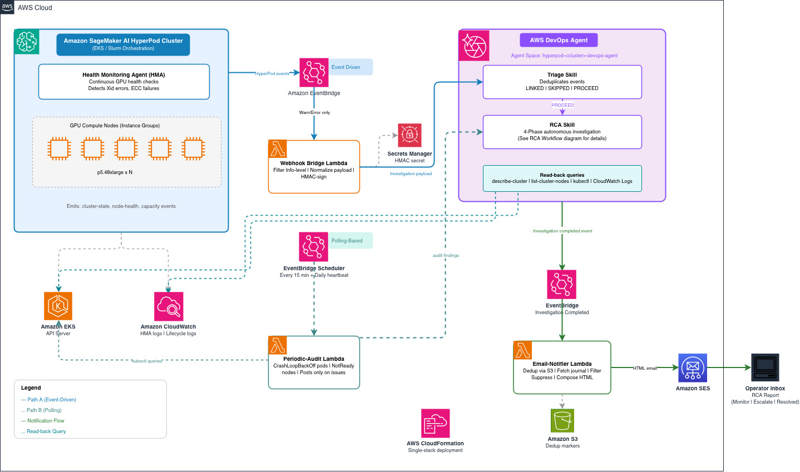

# Architecture

The whole solution deploys as **one AWS CloudFormation stack per cluster**. Two
event paths feed the DevOps Agent, and one path carries its verdicts back out
to you.



This architecture shows a 1:1 relationship between a HyperPod cluster and a
DevOps Agent space, and the deployment instructions in this guide follow that
model. If you need to associate multiple clusters with a single Agent Space,
you can customize the CloudFormation template and the `ClusterFilter` parameter
to widen the allowlist of cluster names forwarded by the webhook bridge.

## Event flow

1. **Event-driven issue detection** - HyperPod emits cluster-state, node-health,
   and capacity events to [Amazon EventBridge](https://aws.amazon.com/eventbridge/).
   The webhook bridge Lambda drops routine `Info`-level noise, maps the rest
   into a DevOps Agent investigation payload, signs it with HMAC-SHA256 using a
   shared secret stored in
   [AWS Secrets Manager](https://aws.amazon.com/secrets-manager/), and POSTs it
   to the agent's generic webhook.
2. **Polling-based issue detection** - A periodic-audit Lambda checks
   Kubernetes state (`CrashLoopBackOff` pods, `NotReady` nodes) every
   15 minutes and fires only when it finds a real issue, plus a daily heartbeat
   confirming the pipeline is alive. On a healthy cluster, nothing is POSTed -
   no investigation runs and no cost is incurred.
3. **Investigation** - DevOps Agent receives the payload and runs two custom
   skills: the triage skill decides whether to link (duplicate), skip (noise),
   or proceed (investigate); the RCA skill reconstructs the timeline using
   `describe-cluster`, `list-cluster-nodes`, `list-cluster-events`, `kubectl`,
   and CloudWatch logs (HMA health monitoring, lifecycle scripts), then
   classifies the incident as `Suppress`, `Monitor`, `Escalate`, or `Resolved`.
4. **Notification** - An [Amazon SES](https://aws.amazon.com/ses/) email
   notifier Lambda listens on the `aws.aidevops` event stream for
   `Investigation Completed` events, reads the verdict from the agent's
   journal, and sends an email with the headline, what happened, likely cause,
   and recommended action. `Suppress` verdicts are filtered to avoid noise on
   healthy clusters.

## Building blocks

| Block | What it does |
| --- | --- |
| **Foundation** | The DevOps Agent *Agent Space* + IAM roles + AWS-monitor association (topology discovery). For EKS clusters, a read-only EKS access entry so the agent can run `kubectl`. Slurm skips the EKS step automatically. |
| **Webhook bridge** | EventBridge rule on `aws.sagemaker` HyperPod events → Lambda → HMAC-signed webhook POST. Supports a cluster allowlist for multi-cluster accounts. |
| **Triage + RCA skills** | Two plain-English skills that teach the agent HyperPod's operational model: `hyperpod-incident-triage` (LINK / SKIP / PROCEED) and `hyperpod-incident-rca` (timeline → Suppress / Monitor / Escalate / Resolved verdict). |
| **Periodic audit** | `AWS::Scheduler::Schedule` → Lambda that inspects Kubernetes state and fires an investigation only on a real issue, plus a daily heartbeat. |
| **Email notifier** | EventBridge rule on `aws.aidevops` `Investigation Completed` → Lambda → SES email, with S3-marker dedup and `Suppress`-verdict filtering. |

The two skills are where HyperPod knowledge lives, and where **you add your
own rules**: drop a new skill directory under `skills/` and redeploy. See
[Extending & APIs](./04-extending.md) for details.

## Two custom resources

Everything is deployed with official CloudFormation resource types **except**
two gaps that CloudFormation cannot express:

1. **eventChannel webhook** - `AWS::DevOpsAgent::Service` has no `eventChannel`
   ServiceType, and `AWS::DevOpsAgent::Association` with an `EventChannel`
   configuration does not expose the generated webhook URL / HMAC secret as a
   `Fn::GetAtt`. → `Custom::WebhookProvisioner` (register / associate + stash
   the secret into Secrets Manager).
2. **Skill assets** - there is no `AWS::DevOpsAgent::Asset` resource type.
   → `Custom::SkillUploader` (create / update / delete skill assets from S3).

The EKS access grant is the native `AWS::EKS::AccessEntry` (skipped
automatically for Slurm clusters).

## Slurm specifics

### Continuous Provisioning is a prerequisite

Without it (`NodeProvisioningMode` != `Continuous` in `describe-cluster`):

- `list-cluster-events` is **not supported** - the RCA skill reconstructs its
  incident timeline (replacement attempts, including failed ones) from this
  API, so its verdicts degrade badly without it.
- The HyperPod **EventBridge event format differs** from what the webhook
  bridge and skills expect, so live event bridging is unreliable.

`make deploy` checks `NodeProvisioningMode` for Slurm clusters and prints a
loud warning (but does not hard-fail) when it isn't `Continuous`. EKS-
orchestrated clusters are always Continuous, so this only affects Slurm.

Beyond that prerequisite: `make deploy` detects a Slurm cluster (no
`Orchestrator.Eks.ClusterArn`) and skips both EKS access entries (the Agent
Space role's and the audit Lambda's). On Slurm the periodic audit has no
Kubernetes to poll, so it fires **only the daily heartbeat** - all HyperPod
faults (capacity, node health, lifecycle-script, cluster state) flow through
the event-driven bridge, which works on Slurm as long as Continuous
Provisioning is enabled.

### HMA CloudWatch bridge (Slurm-only workaround)

On EKS-orchestrated HyperPod clusters the control plane emits a `Warn`-level
`SageMaker HyperPod Cluster Event` on EventBridge whenever HMA detects a GPU
fault (e.g. `NvidiaGPUUnhealthy` / Xid errors / ECC DBE). That flows through
the webhook bridge into DevOps Agent, produces an investigation, and delivers
an email - no extra wiring needed.

On **Slurm-orchestrated** HyperPod clusters, the control plane does not
currently emit that Warn event for HMA-attributed faults today. HMA still
writes its detection JSON to the cluster's CloudWatch log group
(`/aws/sagemaker/Clusters/<name>/<id>` under
`SagemakerHealthMonitoringAgent/<group>/<instance>` streams), and HyperPod HMA
still initiates node replacement - but no operator-visible EventBridge event
is produced, so the DevOps Agent pipeline never runs for HMA-origin faults on
Slurm.

This solution ships a Slurm-only workaround: a CloudWatch Logs subscription
filter on the cluster's log group, plus a tiny `hma_cw_bridge` Lambda that
parses the HMA JSON record and calls `events:PutEvents` with a synthetic
`SageMaker HyperPod Cluster Event Warn` shaped exactly like the native EKS
event. The existing webhook bridge Lambda picks it up unchanged.

`make deploy` auto-enables the workaround for Slurm clusters and disables it
for EKS (where it would produce duplicate investigations for the same fault).
Override via `params.json` if you have a specific reason:

```json
"__off_EnableHmaCloudWatchBridge": "false",
"__off_HmaLogGroupName": "/aws/sagemaker/Clusters/my-cluster/abc123"
```

When set to `false`, the four bridge resources (Lambda, IAM role, subscription
filter, permission) are not deployed. Rollback is
`EnableHmaCloudWatchBridge=false` + redeploy. See
[IMPLEMENTATION.md](https://github.com/awslabs/awsome-distributed-ai/blob/main/1.architectures/5.sagemaker-hyperpod/tools/devops-agent/IMPLEMENTATION.md#hma-cloudwatch-bridge-slurm-only)
in the source repo for the design rationale and failure semantics.
