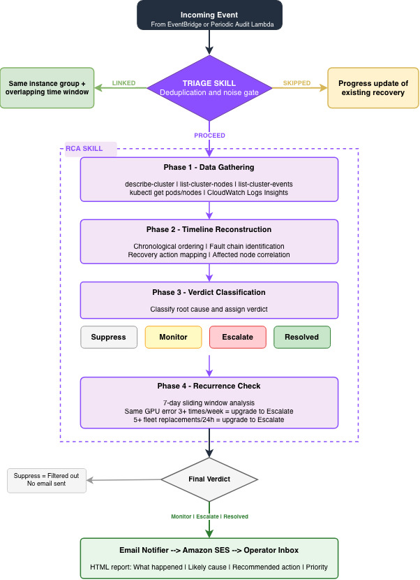

# Deploy & Configure

The solution deploys as a single CloudFormation stack. Clone the
[awsome-distributed-ai repository](https://github.com/awslabs/awsome-distributed-ai/tree/main),
create a `params.json` with your cluster name and email settings, and run:

```bash
cd 1.architectures/5.sagemaker-hyperpod/tools/devops-agent

# 1. Set up a Python env with boto3 >= 1.43.25
python3 -m venv .venv && source .venv/bin/activate && pip install 'boto3>=1.43.25'

# 2. Fill in your cluster name and email addresses
cp deploy/params.example.json deploy/params.json
# edit: HyperPodClusterName, EmailSender, EmailRecipients

# 3. Deploy
make deploy
```

This provisions the Agent Space with read-only EKS access (auto-discovered
from the cluster's `Orchestrator.Eks.ClusterArn`), the EventBridge rule and
webhook bridge Lambda, the periodic-audit scheduler, and the email notifier.
For Slurm-orchestrated clusters, the EKS access step is skipped automatically.

Before touching any AWS resources, `make deploy` pre-flights that
`boto3 >= 1.43.25` is present (it never installs it for you). It then auto-
discovers the underlying EKS cluster name, pre-flights the EKS auth mode (must
be `API` or `API_AND_CONFIG_MAP`, aborting with the corrective command if not),
ensures the S3 assets bucket, syncs the skills, embeds the Lambda code, and
deploys. After deployment:

```bash
make stack-outputs     # console URL, webhook secret ARN, marker bucket, ...
```

## Minimal `params.json`

The only three required keys (plus optional `Region`):

```jsonc
{
  "Region": "us-west-2",                          // optional; falls back to the AWS CLI default region
  "HyperPodClusterName": "my-hyperpod-cluster",   // the cluster this stack monitors
  "EmailSender": "alerts@example.com",            // SES-verified From address (verify it first)
  "EmailRecipients": "oncall@example.com,team@example.com"  // comma-separated; in the SES sandbox each must be verified too
}
```

That is a complete, deployable file. Everything else has a safe default.

`EksClusterName`, `AssetsBucket`, `SkillsVersion`, `SkillsManifest`,
`SkillUploaderS3Bucket`, and `SkillUploaderS3Key` are **filled in
automatically** by `make deploy` - do **not** set them in `params.json`.

## Optional parameters

To override an optional parameter, add it as a normal key. In
`params.example.json` the optional keys ship with an `__off_` prefix (and keys
starting with `__` are ignored) so the example stays at defaults - **remove
the `__off_` prefix to activate one**. For example, to page sooner on
`CrashLoopBackOff` and only forward events for two named clusters:

```jsonc
{
  "Region": "us-west-2",
  "HyperPodClusterName": "my-hyperpod-cluster",
  "EmailSender": "alerts@example.com",
  "EmailRecipients": "oncall@example.com",

  "CrashLoopMinRestarts": "3",
  "ClusterFilter": "my-hyperpod-cluster,my-other-cluster"
}
```

| Parameter | Default | What it controls |
| --- | --- | --- |
| `Region` | AWS CLI default | Target region. Read by `deploy.sh`; not a CloudFormation parameter. |
| **Periodic audit** | | |
| `EnablePeriodicAudit` | `true` | Deploy the 15-minute audit Scheduler + Lambda. `false` = live event bridging only. |
| `AuditSchedule` | `rate(15 minutes)` | EventBridge Scheduler expression for the periodic audit. |
| `HeartbeatSchedule` | `cron(0 12 * * ? *)` | Scheduler expression for the daily "all clear" heartbeat. |
| `K8sChecksEnabled` | `true` | Master switch for the Kubernetes-state checks (`CrashLoopBackOff`, `NotReady`). |
| `CrashLoopMinRestarts` | `5` | Fire only when a container's `restartCount` reaches this. Kubernetes doesn't expose loop-start in a snapshot, so `restartCount` is the crash-evidence signal. |
| `CrashLoopRecencyMinutes` | `15` | The most recent crash must be within this window to count as an active loop (a pod that looped then recovered stops firing). |
| `NotReadyNodePercentThreshold` | `10` | Escalate if ≥ this percent of nodes are `NotReady` (after the duration gate). |
| `NotReadyDurationMinutes` | `15` | A node must be `NotReady` this long to count toward the percent threshold. |
| `IgnoreNamespaces` | `kube-public,kube-node-lease` | Namespaces skipped entirely. Must not overlap `SystemNamespaces`. |
| `SystemNamespaces` | `kube-system,aws-hyperpod,amazon-cloudwatch` | Platform namespaces; `CrashLoop`s here are tagged `system-workload`. |
| **Webhook bridge** | | |
| `ClusterFilter` | `""` (this stack's cluster) | Comma-separated allowlist of cluster names to forward. Empty = only `HyperPodClusterName`. |
| `DropEventLevels` | `Info` | Comma-separated `EventLevel`s to drop (drops noisy `Info`-level events by default). |
| **Email notifier** | | |
| `EmailDetailTypes` | `Investigation Completed` | Comma-separated detail-types to email on (default: one email per incident lifecycle). |
| `ConsoleUrlTemplate` | `https://%agent_space_id%.aidevops.global.app.aws/investigation/%task_id%` | Per-investigation link in emails. Tokens: `%region%`, `%account%`, `%agent_space_id%`, `%task_id%`. |
| `ForceSend` | `false` | Bypass all email filters (dedup, no-findings, suppress). Debugging only. |
| `MarkerExpirationDays` | `30` | Retention (days) for the per-execution email dedup markers. |
| **Advanced** | | |
| `AgentSpaceName` | auto (`hyperpod-<cluster>-devops-agent`) | Friendly Agent Space name. |
| `AgentSpaceDescription` | auto-generated | Free-text Agent Space description. |
| `AgentSpaceRoleName` / `WebappRoleName` | auto-named per stack | Fixed IAM role names (only set if you need them stable). |
| `LcsBucketArnPattern` | `arn:aws:s3:::sagemaker-*-bucket` | ARN pattern of lifecycle-script buckets the RCA skill may read (`on_create.sh`). `""` to skip. |

The template's inline `Description` fields and the
`AWS::CloudFormation::Interface` groups in
`deploy/hyperpod_devops_agent.template.yaml` remain the authoritative source
for every parameter.

## Multiple clusters in one account/region

Every collision-prone name is scoped per cluster, so you can deploy this stack
for several HyperPod clusters side by side without conflicts:

- **Stack name** defaults to `hyperpod-devops-agent-<slug>` (override with
  `STACK_NAME=...`).
- **S3 buckets** - `hpda-markers-<slug>-<account>-<region>` (created by the
  stack) and `hpda-assets-<slug>-<account>-<region>` (created by
  `make deploy`).
- **IAM roles** - the Agent Space + Webapp roles are CloudFormation
  auto-named by default (unique per stack). Set `AgentSpaceRoleName` /
  `WebappRoleName` only if you need fixed names.
- **Webhook secret** and **Agent Space** already include the cluster name.

Use per-cluster params files:

```bash
PARAMS_FILE=deploy/params.<cluster>.json make deploy
```

`<cluster>` is a lowercased, hyphenated, ≤20-char form of `HyperPodClusterName`
(e.g. `My_Prod-Cluster_01` → `my-prod-cluster-01`).

## The webhook bridge - mapping HyperPod events to DevOps Agent

An EventBridge rule captures HyperPod events and invokes a Lambda function.
The Lambda forwards all `Warn` and `Error` level events, normalizing each into
a DevOps Agent investigation payload - extracting the failure message,
instance group, and event metadata - signs it with HMAC using a shared secret
stored in AWS Secrets Manager, and POSTs it to the agent's generic webhook
endpoint. `Info`-level events are dropped at the bridge to avoid creating
investigations for routine status updates.

A cluster allowlist parameter (`ClusterFilter`) lets you scope which HyperPod
clusters trigger investigations, useful when multiple clusters share the same
account and region.

## How the skills are defined - teaching the agent HyperPod's operational model

AWS DevOps Agent skills are plain-English instructions that teach the agent
how to reason about a domain. This solution includes two complementary skills.

### Triage skill - LINKED / SKIPPED / PROCEED

The triage skill
([view the skill document](https://github.com/awslabs/awsome-distributed-ai/blob/main/1.architectures/5.sagemaker-hyperpod/tools/devops-agent/skills/hyperpod-incident-triage/SKILL.md))
runs first on every incoming task. It decides whether to **link** the event
to an existing investigation, **skip** it, or **proceed** to a full
investigation.

:::info Why triage matters - a concrete example
When a single node fails, HyperPod's replacement process emits multiple events
in quick succession - "lost orchestration-ready status", "provisioning
started", "capacity request initiated". Without triage, each event would spawn
a separate investigation. The triage skill recognizes these events belong to
the same incident (same instance group + overlapping time window) and *links*
them, so only one investigation runs. This saves investigation compute and
avoids duplicate emails.

**When to SKIP:** when a node is already being replaced and a follow-up "lost
orchestration-ready status" event arrives with a generic "Request to service
failed" message, the triage skill recognizes that a replacement is already in
progress for that instance group and skips the event - no new investigation
is created for what is simply a progress update of an existing recovery.
:::

### RCA skill - timeline reconstruction and verdict

When triage produces `PROCEED`, the RCA skill
([view the skill document](https://github.com/awslabs/awsome-distributed-ai/blob/main/1.architectures/5.sagemaker-hyperpod/tools/devops-agent/skills/hyperpod-incident-rca/SKILL.md))
takes over. It reads cluster state, events, and logs, reconstructs an
incident timeline, and classifies the situation into one of four verdicts.



- **Phase 1 - Data gathering:** the skill reads `describe-cluster`,
  `list-cluster-nodes`, `list-cluster-events`, and CloudWatch log streams
  (HMA health monitoring, lifecycle scripts) to collect the raw facts.
- **Phase 2 - Timeline reconstruction:** it orders events chronologically and
  identifies the fault chain - what triggered what, which nodes were
  affected, and what recovery actions HyperPod took.
- **Phase 3 - Classification:** based on the timeline, recurrence statistics,
  and HyperPod's resiliency behavior, it assigns a verdict:
  - **Suppress** - a non-issue (e.g. a transient event that has already
    resolved).
  - **Monitor** - recovery is in flight; here's the expected resolution
    window.
  - **Escalate** - you need to act; here's the root cause and recommended
    action.
  - **Resolved** - auto-recovery closed the loop; no action needed.
- **Phase 4 - Recurrence check:** the skill computes sliding-window
  statistics over the 7-day cluster event history. When thresholds are
  crossed - for example, the same GPU error signature on the same instance
  group three or more times in a week, or five or more replacements
  fleet-wide in 24 hours - the verdict escalates to alert the operator of a
  systemic pattern worth investigating further.

The verdict is written to the agent's investigation journal along with a
human-readable report containing what happened, the likely cause, and
recommended operator actions.

## The periodic-audit Lambda - Kubernetes state monitoring

**Division of labor:** HyperPod control-plane faults (node health, capacity
errors, lifecycle-script failures, cluster state changes) are handled
event-driven by the webhook bridge - it reads the native `EventLevel` from
the EventBridge event and forwards the real `FailureMessage`, for both EKS
and Slurm. The periodic audit covers only what the event stream **cannot**:
Kubernetes Pod/Node state, which is not in the HyperPod event stream.

The audit runs on a schedule (default every 15 min): the Lambda inspects
Kubernetes state - `CrashLoopBackOff` pods and `NotReady` nodes (via read-only
EKS API access) - and POSTs the DevOps Agent webhook **only when a real issue
is found**. On a healthy cluster nothing is POSTed, so no investigation runs
and no cost is incurred.

Namespace-aware filtering controls which pods are checked:

- Pods in `kube-public` and `kube-node-lease` are ignored entirely by
  default.
- Pods in `kube-system`, `aws-hyperpod`, and `amazon-cloudwatch` are tagged
  as `system-workload` issues (distinct from user-workload issues in the
  verdict).

All thresholds and namespace lists are configurable via the CloudFormation
stack parameters.

A separate daily `HeartbeatSchedule` fires one "all clear" investigation per
day so operators can see the pipeline is alive; it is visible in the DevOps
Agent console and `make audit-logs` but is **deliberately never emailed**
(don't watch your inbox for it). **On Slurm (no kubectl) the audit has
nothing to poll, so it fires only the heartbeat** - HyperPod faults on Slurm
still flow through the event-driven bridge.

The audit Lambda has its **own** read-only `AWS::EKS::AccessEntry` (distinct
principal from the Agent Space role) carrying `AmazonAIOpsAssistantPolicy` -
note **not** `AmazonEKSViewPolicy`, whose `view` role excludes cluster-scoped
`nodes` and can't satisfy the `NotReady`-node check. The Lambda calls the
K8s API directly (SigV4 token + stdlib `urllib`) - no `kubernetes` client or
Lambda layer.

## Closing the loop - the email notifier

An EventBridge rule on the `aws.aidevops` event stream captures investigation
lifecycle events. The email-notifier Lambda processes these events through
the following steps:

1. **Event filtering** - Only `Investigation Completed` events are processed
   (one email per investigation lifecycle). The event payload contains the
   `agent_space_id`, `task_id`, and `execution_id`.
2. **Dedup** - The Lambda checks an S3 marker at
   `s3://<bucket>/emailed/<execution_id>`. If present, this investigation has
   already been emailed and the event is dropped. This prevents duplicate
   emails when the same completion event is re-emitted.
3. **Fetching the investigation context** - The Lambda calls two DevOps
   Agent APIs:
   - `get_backlog_task(agentSpaceId, taskId)` - retrieves the task metadata
     (title, priority, timestamps).
   - `list_journal_records(agentSpaceId, executionId)` - retrieves the
     investigation's findings, symptoms, and investigation gaps from the
     agent's journal.
4. **Suppress-verdict filtering** - If the investigation produced a
   `Suppress` verdict or no findings at all, no email is sent.
5. **Email composition** - The Lambda composes a single HTML email from the
   journal records: a short headline followed by a one-paragraph summary
   covering what happened, the likely cause, and the recommended action.
6. **Send via SES** - The formatted email is sent to the configured
   recipients. After successful delivery, the S3 dedup marker is written.

The operator also has access to the full investigation in the DevOps Agent
web console (see [Viewing & Interacting](./03-viewing-investigations.md)).

## Updating

- **Parameters / thresholds:** edit `deploy/params.json`, re-run `make deploy`.
- **Skills or the mental-model doc:** edit the file under `skills/` (or
  `docs/hyperpod-mental-model.md`), then `make deploy`. `sync-skills`
  recomputes the content hash (`SkillsVersion`); the change makes
  CloudFormation re-run `SkillUploader`, which re-uploads only what changed.

## Operating

```bash
make stack-status                                      # show the stack status
make bridge-logs / make audit-logs / make email-logs   # tail a Lambda's logs
make audit-test                                         # invoke the audit Lambda once
make import-upstream-skills                             # stage curated upstream skills, then: make deploy
```
