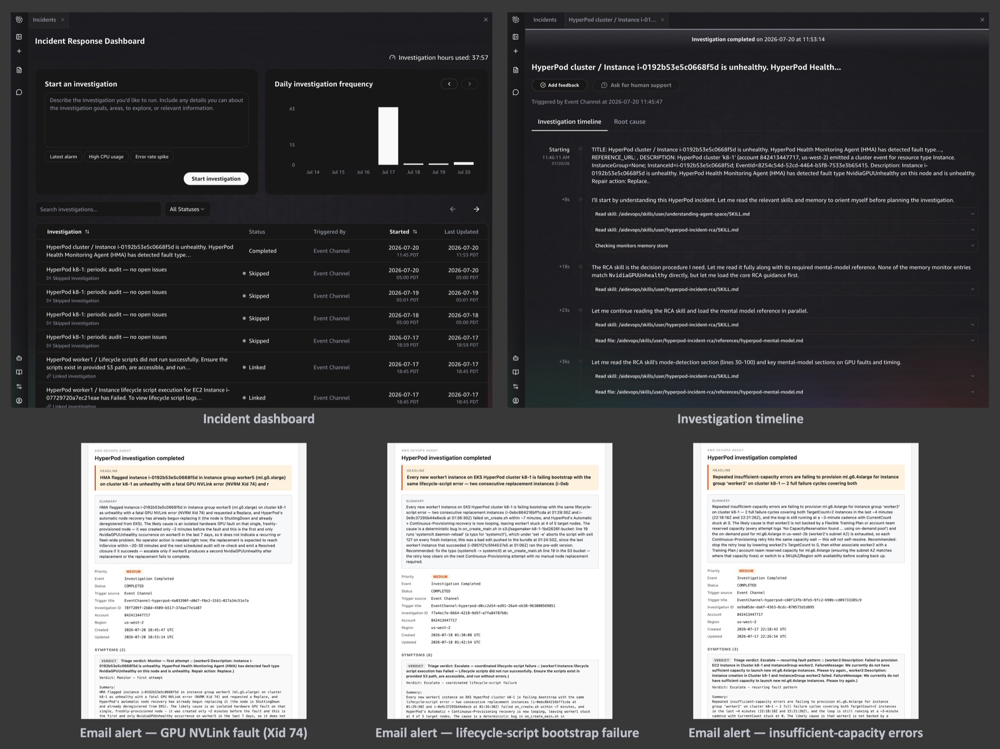
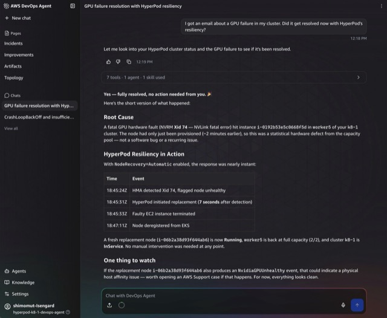

# Viewing investigations & interacting with the agent

## Viewing investigations in the DevOps Agent console

For readers new to AWS DevOps Agent, here's how to navigate to your
investigations:

1. Open the [AWS DevOps Agent console](https://console.aws.amazon.com/aidevops/home).
2. Select your **Agent Space** (named `hyperpod-<cluster-name>-devops-agent`
   by default).
3. From the **Launch web app** drop-down, choose an option to open the DevOps
   Agent web app.
4. Select **Incidents** from the left navigation pane to open the **Incident
   Response Dashboard**. It lists all investigations with their subject,
   status, and timestamp.
5. Select any investigation to see its full timeline, journal records, and
   the verdict report.

## Asking the agent directly - the DevOps Agent chat UI

Beyond the automated emails, you don't have to wait for the next
investigation to get answers about your cluster. You can open the DevOps
Agent's AI chat at any time and ask follow-up questions in plain English - the
agent answers from the live cluster state, the investigation history, and the
skills it has been taught.

For example:

- *"I got an email about a GPU failure in my cluster. Did it get resolved now
  with HyperPod's resiliency?"* - the agent checks the current cluster state,
  confirms whether the replacement succeeded, and provides a timeline of what
  happened (HMA detection → replacement initiated → node back in service),
  along with anything to watch for.
- *"Are there unhealthy Pods on my cluster?"* - the agent inspects the
  Kubernetes state and reports any `CrashLoopBackOff` pods or `NotReady`
  nodes.
- *"I just triggered scaling up. Check if it is progressing well."* - the
  agent looks at the cluster's current node counts vs. target counts and
  reports whether provisioning is on track.

The chat conversations are stored per Agent Space, so you can revisit past
interactions alongside the automated investigations. This makes the Agent
Space a single pane of glass for both automated incident response and
ad-hoc troubleshooting of your HyperPod cluster.

## Investigation feedback

After each investigation completes, a **Feedback** button appears in the
DevOps Agent console. Clicking it opens the Investigation feedback dialog,
where you can:

- Rate whether the root cause was correct
- Indicate whether human steering was needed during the investigation
- Provide written feedback explaining what could be improved

This structured feedback is stored per investigation. An auto-learning
mechanism that uses this feedback to improve future investigations is
actively being developed.

## Cost at a glance

This solution is designed to be **near-zero cost on a healthy cluster** and
scales proportionally with fault volume, not node count directly.

- **Healthy cluster (no faults):** only the daily heartbeat fires -
  approximately **$30–60/month** in DevOps Agent time.
- **Moderate faults (~5/week):** approximately **$80–120/month**; each
  investigation is **~$4** at an 8-minute average.
- **Supporting AWS infrastructure** (Lambda, S3, Secrets Manager,
  EventBridge, SES, CloudWatch Logs): **under $2/month**.
- **Free tier:** new DevOps Agent customers receive a 2-month free trial
  (20 hours of investigations + 20 hours of chat per month).

At scale, the triage skill is your cost saver - a single hardware fault can
generate 5–10 correlated EventBridge events, and triage links them into a
single investigation instead of five.

For detailed cost tables by cluster size, scaling analysis, and cost control
levers, see the AWS blog post (link to be added when published).
