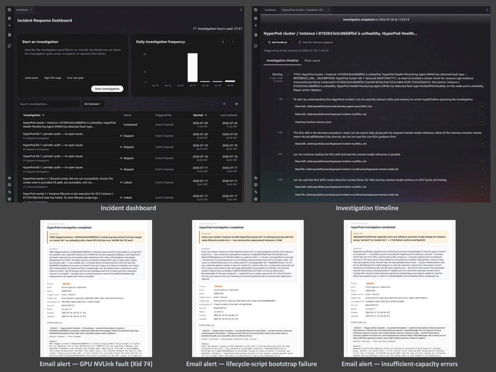

# HyperPod × AWS DevOps Agent

Wire any Amazon SageMaker HyperPod cluster (EKS or Slurm orchestrator) into
[AWS DevOps Agent](https://docs.aws.amazon.com/devopsagent/) so the operational
conditions that call for a human decision get auto-detected, triaged,
root-caused, and delivered as a human-readable verdict email - with room to add
your own detection rules as plain-English *skills*.

Large-scale ML workloads - training, fine-tuning, and inference - run on
clusters of hundreds to thousands of GPU instances for days or weeks at a
stretch. Hardware health events, node lifecycle transitions, capacity
fluctuations, and workload-level issues appear in the event stream around the
clock. This solution turns that stream into a 24/7 companion that watches for
the conditions still needing a human decision, triages them, root-causes them,
and delivers a clear verdict with recommended actions.

## What HyperPod already handles and what this adds

SageMaker HyperPod's built-in resiliency automatically detects and self-heals
**instance-level GPU failures**. When the Health Monitoring Agent (HMA)
identifies a bad GPU, the node is drained, rebooted or replaced depending on the
error type, and the job resumes - without human intervention.

**This solution does not replace HMA or any part of HyperPod's resiliency.** It
adds an autonomous investigation layer on top, using the cluster events and
health signals that HMA and HyperPod already produce as its input. Every
corrective action (node reboots, replacements, drains) continues to be
performed by HyperPod's own resiliency layer or by an operator responding to
the emailed verdict.

By design, DevOps Agent runs strictly in **observe-and-report mode** for this
integration - it has no SSM, SSH, or action-taking capability against your
cluster or its nodes. The agent reads cluster events, control-plane state,
Kubernetes objects, and CloudWatch logs to reconstruct what happened; the
read-only boundary keeps the agent's blast radius zero while still delivering
the correlation and triage value.

## Operational conditions this solution watches for

With HyperPod's self-healing already in place, these are the conditions where a
human still wants to be in the loop:

- **Configuration issues** - a lifecycle-script change, a misconfigured mount,
  or a networking/security change that causes provisioning failures on every
  new node.
- **Capacity conditions** - a replacement waiting on capacity in the pool,
  where the operator needs to know recovery is in flight and can decide whether
  to intervene.
- **Recurring hardware faults** - each fault self-heals correctly, but the same
  GPU error signature recurring across 3+ replacements on one instance group in
  a week is a pattern worth surfacing to an operator as a single signal.
- **Workload-level conditions** - Pods stuck in `CrashLoopBackOff` for hours,
  nodes sitting `NotReady`, or GPU allocation chronically low.

## What you get

- **Auto-detection** of HyperPod conditions that complement resiliency's
  self-healing, from the live SageMaker event stream and a periodic
  Kubernetes-state audit.
- **Triage + root-cause analysis** by the DevOps Agent, taught HyperPod's
  operational model via two custom skills - it reconstructs the incident
  timeline and decides whether HyperPod is still recovering or needs an
  operator.
- **Human-readable verdict emails** - `Monitor` (recovery in flight, here's the
  ETA), `Escalate` (you need to act, here's why and what to do), or `Resolved`
  (auto-recovery closed the loop) - with the noise filtered out.
- **Extensibility** - customize what conditions are detected (by modifying the
  periodic-audit Lambda) and how the agent reasons about them (by editing the
  plain-English skills).

## Prerequisites

| Requirement | Why | How to check / satisfy |
| --- | --- | --- |
| AWS account with **AWS CLI v2** configured for the target region | The deploy runs from your workstation | `aws sts get-caller-identity` - and either `aws configure set region <region>` or add `Region` to `params.json` |
| An existing **SageMaker HyperPod cluster** (EKS or Slurm) | Everything in this solution operates against a running cluster | `aws sagemaker describe-cluster --cluster-name <name>` |
| **Continuous Provisioning** on Slurm clusters | `list-cluster-events` (needed by the RCA skill) is not supported otherwise; the EventBridge event format also differs | Confirm `NodeProvisioningMode: Continuous` in `describe-cluster`. EKS-orchestrated clusters are always Continuous |
| **Python 3.9+ with boto3 ≥ 1.43.25** in the environment you run `make deploy` from | Bundled into the skill-uploader Lambda; the Lambda runtime's built-in boto3 predates the DevOps Agent Asset API | `python3 -m venv .venv && source .venv/bin/activate && pip install 'boto3>=1.43.25'` |
| **DevOps Agent CloudFormation resource types available in the cluster's region** | The DevOps Agent data-plane API answers in more regions than the CFN types are registered in; the stack must live in the cluster's region | `aws cloudformation describe-type --type RESOURCE --type-name AWS::DevOpsAgent::AgentSpace --region <region>` |
| IAM permissions to create roles, deploy CloudFormation, manage Secrets Manager, call `devops-agent:*`, `eks:CreateAccessEntry`, and (for email) `ses:SendEmail` from a verified sender | The stack creates roles, secrets, EKS access entries, and posts email through SES | Standard admin or an admin-equivalent scoped principal |
| A **verified Amazon SES sender identity** in the target region | The email notifier sends from this address; SES sandbox also requires verified recipients | `aws ses verify-email-identity --email-address your-sender@example.com` - the address owner clicks the confirmation link |

## What you deploy

Everything deploys as **one CloudFormation stack per cluster**. Two event paths
feed the DevOps Agent, and one path carries its verdicts back to you.

| Step | What | How | Time |
| --- | --- | --- | --- |
| 1 | Verify SES sender identity | `aws ses verify-email-identity ...` + click the confirmation link | ~5 min |
| 2 | Set up a Python env with `boto3>=1.43.25` | `python3 -m venv .venv && source .venv/bin/activate && pip install 'boto3>=1.43.25'` | ~1 min |
| 3 | Configure `params.json` | Copy `params.example.json`, fill in cluster name + email | ~2 min |
| 4 | Deploy the stack | `make deploy` (embeds Lambdas, syncs skills, deploys) | ~10–15 min |

Continue to [Architecture](./01-architecture.md) to see how the pieces fit
together, then [Deploy & Configure](./02-deploy.md) for the step-by-step deploy
and parameter reference.
