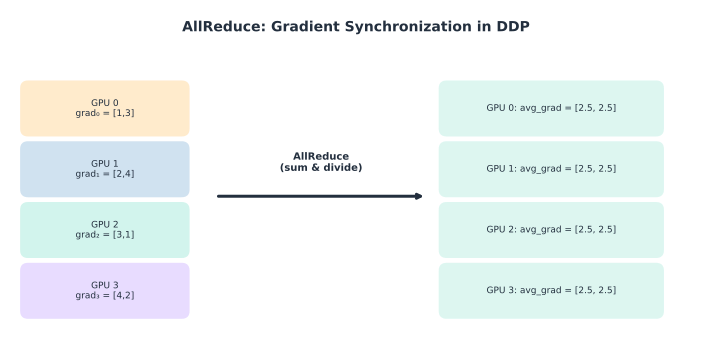
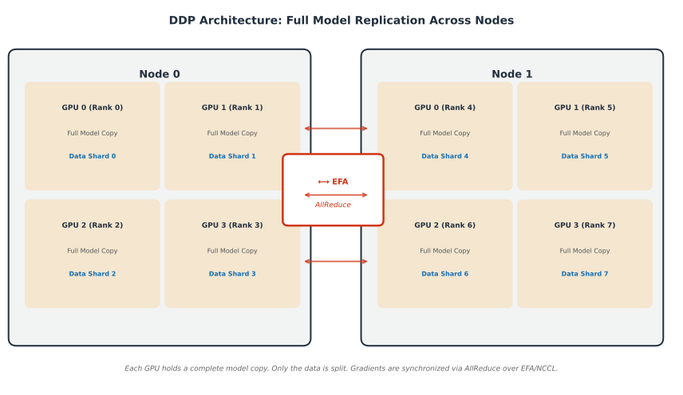

# PyTorch Distributed Data Parallel: A Practical Guide for Multi-Node Pre-Training on SageMaker HyperPod

---

## 1. Introduction

### The Mental Model

Before diving in, here's the complete picture of what DDP does:

> **DDP = Full Model Replication + Data Sharding + AllReduce Gradient Sync**
>
> Every GPU holds the full model. The dataset is split so each GPU trains on different data. After each backward pass, gradients are averaged across all GPUs via AllReduce, ensuring every replica takes the same optimizer step and stays in sync.

### What is DDP and When to Use It

PyTorch **Distributed Data Parallel (DDP)** is the standard approach for scaling model training across multiple GPUs and multiple nodes. It works by replicating your model on every GPU, splitting the data across them, and synchronizing gradients after each backward pass so all replicas stay in sync.

Use DDP when:
- Your model **fits in a single GPU's memory** but training is too slow on one device.
- You want near-linear scaling — 8 GPUs ≈ 8× throughput (minus communication overhead).
- You're pre-training or fine-tuning on large datasets where wall-clock time matters.

**When NOT to use DDP:** If your model does not fit in a single GPU's memory (typically 7B+ parameters in bf16), you need model-parallel approaches like FSDP or DeepSpeed. DDP requires the full model on each GPU.

### How DDP Differs from DataParallel

| Feature | `DataParallel` (DP) | `DistributedDataParallel` (DDP) |
|---------|---------------------|-------------------------------|
| Parallelism | Single-process, multi-thread | Multi-process (one per GPU) |
| Scaling | Single node only | Multi-node native |
| Performance | GIL bottleneck, uneven GPU memory | No GIL, balanced memory |
| Gradient sync | Gather → reduce → scatter on GPU:0 | AllReduce (peer-to-peer) |

**Bottom line:** Always prefer DDP. `DataParallel` is legacy and should not be used for new work.

### Prerequisites

- Comfort writing a PyTorch training loop (model, optimizer, loss, backward, step).
- Access to a SageMaker HyperPod cluster (Slurm or EKS orchestration).
- Python 3.10+, PyTorch 2.x, and `transformers` library installed.

---

## 2. Understanding Network Collectives

<div style={{background: 'white', padding: '1rem', borderRadius: '8px', marginBottom: '1rem'}}>



</div>

*Figure 1: AllReduce averages gradients from all GPUs so every replica receives the same result.*

### What Are Collectives?

A **collective** is a communication pattern where multiple processes (each owning one GPU) exchange data. Think of them as coordination primitives — the distributed equivalent of calling `.sum()` or `.broadcast()` but across machines connected by a network (typically EFA/NCCL on AWS).

### Key Collective Operations

| Collective | What It Does | DDP Use Case |
|-----------|-------------|-------------|
| **AllReduce** | Every process contributes a tensor → all processes receive the sum (or mean) | Gradient synchronization |
| **Broadcast** | One process sends → all receive | Sharing initial model weights |
| **AllGather** | Each process contributes → all get the concatenated result | Gathering predictions for evaluation |
| **ReduceScatter** | Reduce + scatter chunks to each process | Used internally by FSDP |

### AllReduce: The Core of DDP Gradient Sync

After each `.backward()` call, every GPU has locally computed gradients. DDP automatically performs an **AllReduce** on those gradients so every replica ends up with the **same averaged gradient**. This means every replica takes the same optimizer step, keeping the models identical.

```
GPU 0: grad_0 ─┐                ┌─► avg_grad
GPU 1: grad_1 ─┼── AllReduce ───┼─► avg_grad
GPU 2: grad_2 ─┤                ├─► avg_grad
GPU 3: grad_3 ─┘                └─► avg_grad
```

Under the hood, NCCL implements AllReduce using **ring** or **tree** algorithms that overlap communication with computation (DDP buckets gradients and fires AllReduce while the backward pass is still running).

### Process Groups and Ranks

DDP assigns each process an identity:

| Term | Meaning | Example (2 nodes × 4 GPUs) |
|------|---------|---------------------------|
| **World size** | Total number of processes | 8 |
| **Rank** | Global process ID (0 to world_size-1) | 0, 1, 2, …, 7 |
| **Local rank** | GPU index within a single node | 0, 1, 2, 3 |

A **process group** is the set of ranks that participate in a collective. DDP creates a default group containing all ranks.

### How Layers Map to GPUs in DDP (Full Replication)

<div style={{background: 'white', padding: '1rem', borderRadius: '8px', marginBottom: '1rem'}}>



</div>

*Figure 2: DDP replicates the full model on every GPU. Nodes communicate via EFA/NCCL for gradient synchronization.*

Unlike model parallelism (where different layers go to different GPUs), DDP uses **full replication**: every GPU holds a complete copy of all layers. The data is what gets split. This is simpler to reason about and works well as long as the model fits in one GPU.

```
Node 0, GPU 0: [Full Model Copy] ← trains on batch shard 0
Node 0, GPU 1: [Full Model Copy] ← trains on batch shard 1
Node 1, GPU 0: [Full Model Copy] ← trains on batch shard 2
Node 1, GPU 1: [Full Model Copy] ← trains on batch shard 3
```
