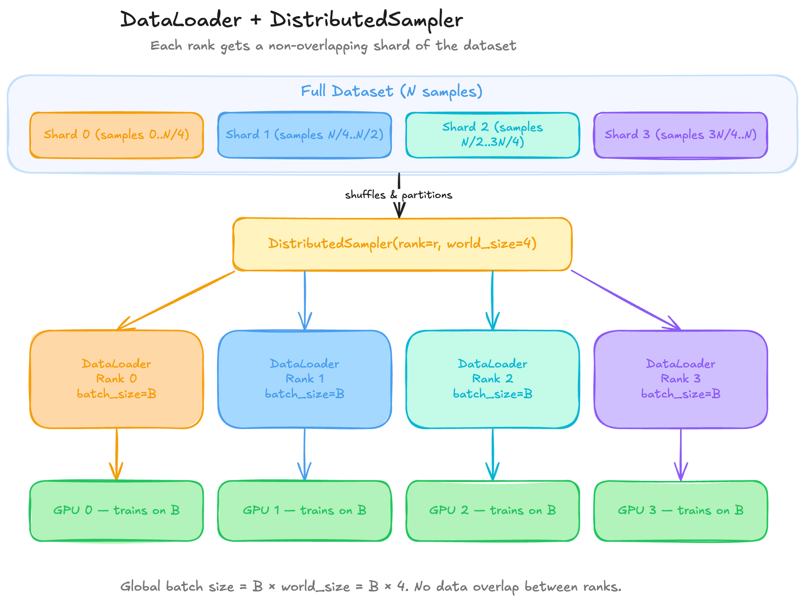

# Understanding DataLoaders in DDP

<div style={{background: 'white', padding: '1rem', borderRadius: '8px', marginBottom: '1rem'}}>



</div>

*Figure 3: DistributedSampler partitions the dataset into non-overlapping shards — one per GPU.*

## How PyTorch DataLoader Works

A `DataLoader` wraps a `Dataset` and provides:
- **Batching** — groups samples into mini-batches.
- **Shuffling** — randomizes the order each epoch.
- **Prefetching** — loads the next batch in background workers while the GPU trains.

```python
from torch.utils.data import DataLoader, Dataset

loader = DataLoader(
    dataset,
    batch_size=32,
    shuffle=True,
    num_workers=4,       # parallel data loading workers
    pin_memory=True,     # faster CPU → GPU transfer
    prefetch_factor=2,   # batches prefetched per worker
)
```

## The Problem: Duplicate Data in Multi-GPU

If every GPU creates a `DataLoader` with `shuffle=True`, each GPU shuffles independently — they may see overlapping samples within an epoch. This wastes computation and breaks the statistical guarantee that every sample is seen exactly once per epoch.

## The Solution: `DistributedSampler`

`DistributedSampler` partitions the dataset into `world_size` non-overlapping shards. Each rank only sees its own shard:

```python
from torch.utils.data import DataLoader, DistributedSampler

sampler = DistributedSampler(
    dataset,
    num_replicas=world_size,  # total GPUs
    rank=rank,                # this process's ID
    shuffle=True,
)

loader = DataLoader(
    dataset,
    batch_size=32,
    sampler=sampler,          # replaces shuffle=True
    num_workers=4,
    pin_memory=True,
    prefetch_factor=2,
)
```

**Important:** When using a `DistributedSampler`, do **not** pass `shuffle=True` to `DataLoader` — shuffling is handled by the sampler. You must also call `sampler.set_epoch(epoch)` at the start of each epoch to ensure different shuffling across epochs.

## Effective Batch Size — The Most Important Equation

When using DDP, your effective batch size increases proportionally to the number of GPUs:

```
effective_batch_size = batch_size_per_gpu × world_size × accumulation_steps
```

**Example:** `batch_size_per_gpu=4`, `world_size=16` (2 nodes × 8 GPUs), `accumulation_steps=2`:
- `effective_batch_size = 4 × 16 × 2 = 128`

This matters because:
- Larger effective batch sizes require **learning rate scaling** (see the DDP script section).
- You should decide your target effective batch size first, then work backward to choose `batch_size_per_gpu` and `accumulation_steps`.

## DataLoader Performance Tips for Multi-Node

| Tip | Why |
|-----|-----|
| `num_workers=4` (or CPUs_per_GPU) | Keeps the GPU fed; too many workers waste memory |
| `pin_memory=True` | Enables async CPU→GPU copies |
| `persistent_workers=True` | Avoids re-spawning workers each epoch |
| `prefetch_factor=2` | Balances memory vs. latency hiding |
| Use `drop_last=True` | Avoids an uneven final batch that would stall AllReduce |
