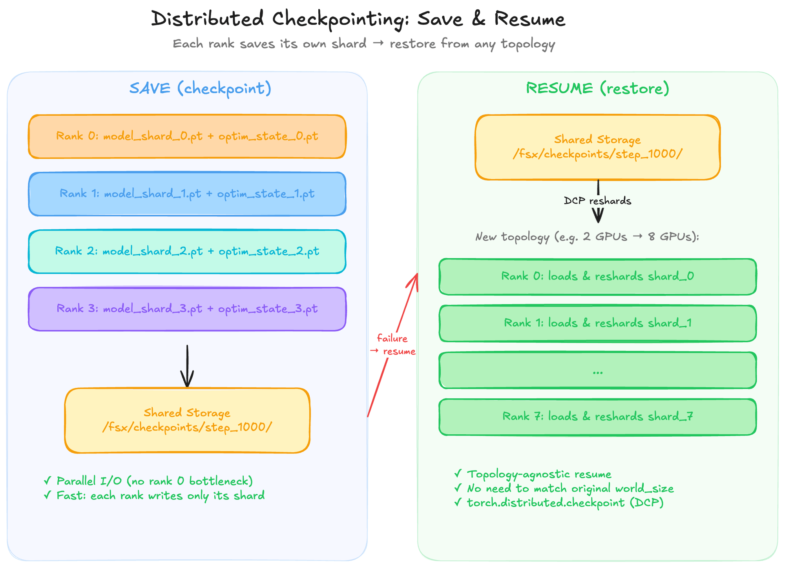

# Distributed Checkpointing: Save and Resume

In multi-node training, checkpointing is critical — jobs can be preempted, nodes can fail, and long-running pre-training runs must be resumable. DDP checkpointing has a few subtleties you need to handle correctly.

## The Core Principle

Since DDP keeps all model replicas identical (thanks to AllReduce), you only need **one rank to save the checkpoint**. By convention, rank 0 writes; all ranks read when resuming.

## Key Implementation Details

The full checkpoint save/load code is already integrated into the training script in the DDP script section. Here's a summary of the critical patterns:

1. **Always save both model AND optimizer state** — optimizer state (momentum, adaptive LR terms) is essential for consistent resume.
2. **Use `model.module.state_dict()`** — unwraps the DDP wrapper to save clean weights.
3. **Atomic saves** — write to a temp file, then `os.rename()` to prevent corruption if interrupted mid-write.
4. **Symlink to latest** — makes resume logic simple (`checkpoint_latest.pt` always points to the last good save).
5. **`map_location`** — when loading, map tensors to the correct GPU: `map_location=f"cuda:{local_rank}"`.
6. **Barriers** — `dist.barrier()` before and after save to ensure all ranks are synchronized.

## Using `torch.distributed.checkpoint` (DCP) — The Modern Approach

<div style={{background: 'white', padding: '1rem', borderRadius: '8px', marginBottom: '1rem'}}>



</div>

*Figure 4: With DCP, every rank writes its own shard in parallel and the checkpoint is resharded on resume.*

For larger runs, PyTorch provides `torch.distributed.checkpoint` (DCP) which supports **async saves** and **sharded checkpoints** (essential for FSDP, but also useful with DDP for faster I/O):

```python
import torch.distributed.checkpoint as dcp
from torch.distributed.checkpoint.state_dict import get_state_dict, set_state_dict


def save_checkpoint_dcp(model, optimizer, checkpoint_dir):
    """Save using DCP — all ranks participate, writes sharded files in parallel."""
    model_state, optimizer_state = get_state_dict(model, optimizer)
    
    state_dict = {
        "model": model_state,
        "optimizer": optimizer_state,
    }
    
    dcp.save(state_dict, checkpoint_id=checkpoint_dir)


def load_checkpoint_dcp(model, optimizer, checkpoint_dir):
    """Load using DCP — all ranks read their shard in parallel."""
    model_state, optimizer_state = get_state_dict(model, optimizer)
    
    state_dict = {
        "model": model_state,
        "optimizer": optimizer_state,
    }
    
    dcp.load(state_dict, checkpoint_id=checkpoint_dir)
    set_state_dict(model, optimizer, model_state_dict=state_dict["model"],
                   optim_state_dict=state_dict["optimizer"])
```

> **When to use DCP vs. `torch.save`:**
> - Use `torch.save` (rank 0 only) for small-to-medium models — simpler, single file, easy to inspect.
> - Use DCP for large models or when checkpoint I/O becomes a bottleneck — all ranks write in parallel, reducing save time proportionally to world size.
