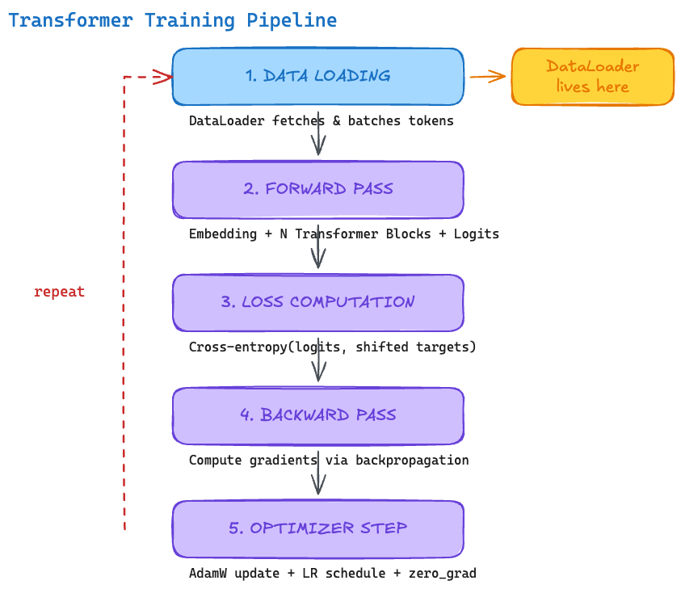

# The Transformer Training Pipeline

<div style={{background: 'white', padding: '1rem', borderRadius: '8px', marginBottom: '1rem'}}>



</div>

*Figure 1: The five stages of a transformer training step. The DataLoader operates exclusively in Stage 1.*

---

## The Five Stages

Every training step in a transformer model follows the same five-stage pipeline. Understanding these stages is essential because the DataLoader's job is to execute Stage 1 fast enough that Stages 2-5 never have to wait.

### Stage 1: Data Loading

The DataLoader fetches the next batch of tokenized sequences from storage, assembles them into tensors (`input_ids`, `attention_mask`, `labels`), and transfers them to GPU memory. This is the **only stage that touches disk or CPU** — everything else runs on the GPU.

```python
# The DataLoader delivers a batch like this:
batch = {
    "input_ids": tensor([...]),   # shape: [batch_size, seq_length]
    "labels": tensor([...]),      # shape: [batch_size, seq_length] (shifted by 1)
}
```

### Stage 2: Forward Pass

The model processes the input through its layers:

1. **Embedding lookup** — converts token IDs to dense vectors.
2. **N transformer blocks** — each block applies self-attention and a feed-forward network (FFN).
3. **Output projection** — maps the final hidden states to vocabulary-sized logits.

```python
outputs = model(input_ids=batch["input_ids"])
logits = outputs.logits  # shape: [batch_size, seq_length, vocab_size]
```

### Stage 3: Loss Computation

The cross-entropy loss compares the predicted logits against the shifted target tokens. For causal language models, token at position `t` predicts position `t+1`:

```python
loss = cross_entropy(
    logits[:, :-1, :].reshape(-1, vocab_size),
    labels[:, 1:].reshape(-1)
)
```

### Stage 4: Backward Pass

PyTorch's autograd computes gradients of the loss with respect to every model parameter via backpropagation. This is typically the most compute-intensive stage (roughly 2x the forward pass cost).

```python
loss.backward()  # Computes gradients for all parameters
```

### Stage 5: Optimizer Step

The optimizer uses the gradients to update model parameters. AdamW maintains per-parameter momentum and variance estimates. This stage also applies gradient clipping and the learning rate schedule:

```python
torch.nn.utils.clip_grad_norm_(model.parameters(), max_norm=1.0)
optimizer.step()
scheduler.step()
optimizer.zero_grad()
```

---

## The Async Pipeline: Why Stage 1 Must Be Fast

In a well-tuned training loop, data loading happens **asynchronously** — the DataLoader's worker processes load the *next* batch while the GPU is busy computing the *current* batch. This means Stages 1 and 2-5 overlap in time:

```
Time →
Worker:  [Load B2] [Load B3] [Load B4] [Load B5] ...
GPU:     [  Compute B1  ] [  Compute B2  ] [  Compute B3  ] ...
                ↑ overlap — GPU never idles
```

If the DataLoader cannot deliver the next batch before the GPU finishes the current one, the GPU **idles**. This is called **GPU starvation** and it is the single most common performance problem in training pipelines.

> **Rule of thumb:** If your GPU utilization is below 90% and you are not communication-bound (gradient sync), the DataLoader is likely the bottleneck.

The remainder of this workshop focuses on making Stage 1 as fast as possible — through efficient data formats, proper DataLoader configuration, and optimized preprocessing.

