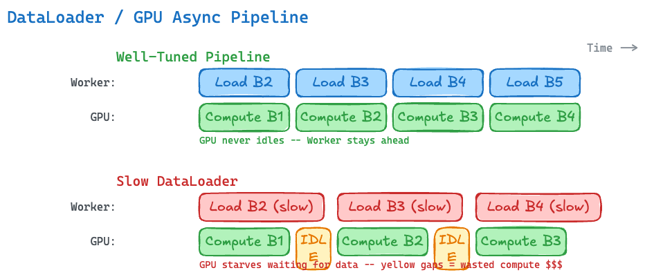

# DataLoader Performance Impact

*Figure 2: A well-tuned DataLoader keeps the GPU fully utilized (top). A slow DataLoader causes GPU starvation — the yellow IDLE gaps represent wasted compute dollars (bottom).*

---

## The Pipeline View

Training is a pipeline: the DataLoader (CPU/disk) and the model (GPU) run concurrently. Performance depends on the **slower** of the two:

| Scenario | Bottleneck | GPU Utilization |
|---|---|---|
| Data loading faster than compute | GPU (good) | ~95-100% |
| Data loading slower than compute | DataLoader (bad) | < 90% |
| Data loading much slower | DataLoader (very bad) | 50-70% |

## Key Performance Factors

| Factor | Impact | Fix |
|---|---|---|
| **I/O bandwidth** | Slow storage = GPU starvation | NVMe local disk >> EBS gp3 >> S3 streaming |
| **Data format** | JSON/CSV parsing is CPU-bound | Pre-tokenize to binary mmap (next section) |
| **`num_workers`** | Too few = can't saturate I/O; too many = CPU contention | Start with CPUs-per-GPU, tune down |
| **Tokenization on-the-fly** | Tokenizer runs in CPU workers, blocking delivery | Pre-tokenize during preprocessing |
| **Prefetch depth** | Shallow buffer can't absorb I/O latency spikes | `prefetch_factor=2` is usually sufficient |
| **Memory copies** | Unpinned memory requires extra CPU→GPU copy | Always use `pin_memory=True` |
| **Shuffle granularity** | Full random shuffle on huge files = random I/O | Shuffle the index, not the data |

## Symptoms of a Bad DataLoader

Here's how to recognize DataLoader bottlenecks during training:

| Symptom | What It Means |
|---|---|
| GPU utilization < 90% (no gradient sync bottleneck) | GPU is idling waiting for data |
| Periodic "stutter" in step time | I/O latency spikes (cache misses, network jitter) |
| Training throughput doesn't scale with more GPUs | Data loading is the ceiling, not compute |
| Workers consuming excessive RAM or crashing (OOM) | Too many workers, or dataset loaded into per-worker memory |
| High CPU utilization with low GPU utilization | Tokenization or parsing running in the hot loop |

## Data Format Comparison

The choice of data format has a direct impact on `__getitem__()` performance — the function that runs billions of times during training:

| Format | Read Pattern | Parsing Cost | I/O Pattern | Verdict |
|---|---|---|---|---|
| JSON Lines (.jsonl) | Read line, parse JSON, extract text | High (string parsing) | Sequential but text-heavy | Slow |
| Parquet / Arrow | Column read, decompress | Medium (decompression) | Columnar, better than JSON | Medium |
| HuggingFace Datasets (Arrow) | Memory-mapped Arrow tables | Low (zero-copy reads) | Random access via mmap | Good |
| **Binary mmap (.bin + .idx)** | Direct memory read, zero parsing | **None** (raw bytes) | Sequential + mmap | **Fastest** |

The rest of this workshop focuses on the binary mmap approach — the format used by Megatron-LM, GPT-NeoX, and most large-scale pre-training frameworks.

## Practical Tuning Checklist

When diagnosing DataLoader performance, work through this checklist in order:

1. **Is the data pre-tokenized?** If not, that's the #1 fix. Tokenization in `__getitem__` is the most common bottleneck.
2. **Is the data in binary format?** JSON/Parquet parsing adds overhead that binary mmap eliminates.
3. **Is `pin_memory=True`?** If not, you're paying for an extra memory copy on every batch.
4. **Is `persistent_workers=True`?** If not, workers are being respawned every epoch — re-opening files, re-mapping memory.
5. **Are there enough workers?** Start with `num_workers = CPUs_per_GPU` and profile.
6. **Is storage fast enough?** Profile I/O with `iostat`. If disk throughput is saturated, move data to faster storage (NVMe > EBS > NFS).

