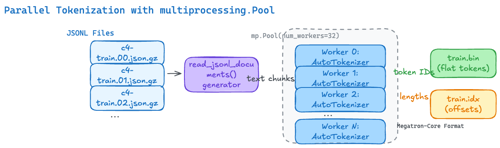

# Preprocessing: JSONL to Binary mmap

In this section, we'll build a complete preprocessing script that converts a JSONL dataset (like allenai/c4) into the Megatron-Core binary format (`.bin` + `.idx`).

---

## The Goal

```
Input:  c4-train.00000.json.gz, c4-train.00001.json.gz, ...
        (JSONL files, each line = {"text": "...", "timestamp": "...", ...})

Output: train.bin  — flat binary array of token IDs (uint16 or int32)
        train.idx  — index file with document offsets and metadata
```

<div style={{background: 'white', padding: '1rem', borderRadius: '8px', marginBottom: '1rem'}}>



</div>

*Figure 3: The preprocessing pipeline reads JSONL files through a generator, tokenizes in parallel across multiple workers, and writes the results to Megatron-Core binary format.*

## The Complete Preprocessing Script

Save this as `preprocess_c4_to_mmap.py`:

```python
"""
preprocess_c4_to_mmap.py

Converts a JSONL dataset (e.g., allenai/c4) into Megatron-Core compatible
binary indexed format (.bin + .idx files).

Usage:
    python preprocess_c4_to_mmap.py \
        --input /data/c4/en/c4-train.*.json.gz \
        --output /data/c4_megatron/train \
        --tokenizer meta-llama/Llama-2-7b-hf \
        --workers 32
"""

import argparse
import glob
import gzip
import json
import os
import struct
import multiprocessing as mp
from pathlib import Path

import numpy as np
from transformers import AutoTokenizer


# ---------------------------------------------------------------------------
# Megatron-Core Index File Format Constants
# ---------------------------------------------------------------------------
DTYPE_TO_CODE = {
    np.uint8: 1, np.int8: 2, np.int16: 3, np.int32: 4,
    np.int64: 5, np.float32: 6, np.float64: 7, np.uint16: 8,
}


def get_dtype_for_vocab(vocab_size: int):
    """Pick smallest dtype that fits all token IDs."""
    if vocab_size <= 255:
        return np.uint8
    elif vocab_size <= 65535:
        return np.uint16
    else:
        return np.int32


def tokenize_document(args):
    """Worker function: tokenize a single JSONL document."""
    text, tokenizer_name = args
    # Each worker lazily initializes its own tokenizer (fork-safe)
    if not hasattr(tokenize_document, '_tokenizer'):
        tokenize_document._tokenizer = AutoTokenizer.from_pretrained(
            tokenizer_name, use_fast=True
        )
    tokenizer = tokenize_document._tokenizer
    token_ids = tokenizer.encode(text, add_special_tokens=False)
    token_ids.append(tokenizer.eos_token_id)  # Explicit EOD marker
    return token_ids


def read_jsonl_documents(input_pattern: str):
    """Yield text from JSONL files (supports gzipped)."""
    files = sorted(glob.glob(input_pattern))
    for fpath in files:
        opener = gzip.open if fpath.endswith('.gz') else open
        with opener(fpath, 'rt', encoding='utf-8') as f:
            for line in f:
                doc = json.loads(line)
                text = doc.get('text', '')
                if text.strip():
                    yield text


def write_mmap_dataset(
    input_pattern: str,
    output_prefix: str,
    tokenizer_name: str,
    num_workers: int = 16,
    chunk_size: int = 1024,
):
    """
    Main preprocessing pipeline:
    1. Read JSONL documents
    2. Tokenize in parallel
    3. Write .bin (flat token array) + .idx (offsets/metadata)
    """
    tokenizer = AutoTokenizer.from_pretrained(tokenizer_name, use_fast=True)
    vocab_size = tokenizer.vocab_size
    dtype = get_dtype_for_vocab(vocab_size)
    print(f"Vocab size: {vocab_size}, using dtype: {dtype.__name__}")

    bin_path = f"{output_prefix}.bin"
    idx_path = f"{output_prefix}.idx"

    os.makedirs(os.path.dirname(output_prefix), exist_ok=True)

    # Accumulators for the index
    sequence_lengths = []
    sequence_pointers = []
    document_indices = []

    current_byte_offset = 0
    total_tokens = 0

    # Write .bin file incrementally
    with open(bin_path, 'wb') as bin_file:
        with mp.Pool(num_workers) as pool:
            documents = read_jsonl_documents(input_pattern)
            work_items = ((text, tokenizer_name) for text in documents)

            for doc_idx, token_ids in enumerate(
                pool.imap(tokenize_document, work_items, chunksize=chunk_size)
            ):
                if len(token_ids) == 0:
                    continue

                tokens_array = np.array(token_ids, dtype=dtype)

                # Record index metadata
                document_indices.append(len(sequence_lengths))
                sequence_lengths.append(len(token_ids))
                sequence_pointers.append(current_byte_offset)

                # Write tokens to .bin
                bin_file.write(tokens_array.tobytes())
                current_byte_offset += tokens_array.nbytes
                total_tokens += len(token_ids)

                if (doc_idx + 1) % 100_000 == 0:
                    print(f"  Processed {doc_idx + 1} documents, "
                          f"{total_tokens:,} tokens, "
                          f"{current_byte_offset / 1e9:.2f} GB")

    # Write .idx file
    num_sequences = len(sequence_lengths)
    num_documents = len(document_indices)

    with open(idx_path, 'wb') as idx_file:
        # Header
        idx_file.write(b"MMIDIDX\x00\x00")
        idx_file.write(struct.pack('<q', 1))          # version
        idx_file.write(struct.pack('<B', DTYPE_TO_CODE[dtype]))
        idx_file.write(struct.pack('<q', num_sequences))
        idx_file.write(struct.pack('<q', num_documents))

        # Sequence lengths (int32)
        seq_lens = np.array(sequence_lengths, dtype=np.int32)
        idx_file.write(seq_lens.tobytes())

        # Sequence byte offsets (int64)
        seq_ptrs = np.array(sequence_pointers, dtype=np.int64)
        idx_file.write(seq_ptrs.tobytes())

        # Document indices (int64)
        doc_idxs = np.array(document_indices, dtype=np.int64)
        idx_file.write(doc_idxs.tobytes())

    print(f"\nDone!")
    print(f"  Documents: {num_documents:,}")
    print(f"  Sequences: {num_sequences:,}")
    print(f"  Total tokens: {total_tokens:,}")
    print(f"  .bin size: {current_byte_offset / 1e9:.3f} GB")
    print(f"  .idx size: {os.path.getsize(idx_path) / 1e6:.3f} MB")
    print(f"  Output: {bin_path}, {idx_path}")


if __name__ == "__main__":
    parser = argparse.ArgumentParser()
    parser.add_argument("--input", required=True,
                        help="Glob pattern for input JSONL files")
    parser.add_argument("--output", required=True,
                        help="Output prefix (e.g., /data/c4_mmap/train)")
    parser.add_argument("--tokenizer", required=True,
                        help="HuggingFace tokenizer name or path")
    parser.add_argument("--workers", type=int, default=16)
    args = parser.parse_args()

    write_mmap_dataset(args.input, args.output, args.tokenizer, args.workers)
```

## Running the Preprocessing

```bash
python preprocess_c4_to_mmap.py \
    --input "/data/c4/en/c4-train.*.json.gz" \
    --output /data/c4_megatron/train \
    --tokenizer meta-llama/Llama-2-7b-hf \
    --workers 32
```

Expected output:
```
Vocab size: 32000, using dtype: uint16
  Processed 100000 documents, 52,431,280 tokens, 0.10 GB
  Processed 200000 documents, 104,862,560 tokens, 0.20 GB
  ...
Done!
  Documents: 364,868,892
  Sequences: 364,868,892
  Total tokens: 173,647,524,718
  .bin size: 347.295 GB
  .idx size: 7284.730 MB
  Output: /data/c4_megatron/train.bin, /data/c4_megatron/train.idx
```

---

## Key Design Decisions Explained

### Why `use_fast=True` on AutoTokenizer?

The `use_fast=True` flag selects the Rust-backed tokenizer from the `tokenizers` library instead of the pure-Python implementation. For batch preprocessing, this is the single biggest performance lever:

| | `use_fast=False` (Python) | `use_fast=True` (Rust) |
|---|---|---|
| Speed | ~10-50x slower | Baseline |
| Parallelism | GIL-bound | Releases GIL |
| Memory | Higher Python object overhead | Lower, raw bytes |

> As of `transformers` v4.40+, `use_fast=True` is the default. Being explicit is good practice for preprocessing scripts that may run on older environments.

### Why `add_special_tokens=False`?

In the flat-concatenation approach used for pre-training, documents are stitched into one continuous token stream. If the tokenizer adds BOS/EOS automatically, you get inconsistent behavior across models:

| Model | `add_special_tokens=True` produces |
|---|---|
| LLaMA 1/2 | `[BOS] ...tokens...` (no EOS) |
| GPT-2 | `...tokens...` (nothing added) |
| Mistral | `[BOS] ...tokens...` |

Instead, we use `add_special_tokens=False` and **manually append the EOS token** as an explicit end-of-document marker. This gives uniform behavior regardless of the tokenizer:

```python
token_ids = tokenizer.encode(text, add_special_tokens=False)
token_ids.append(tokenizer.eos_token_id)  # Explicit EOD marker
```

### Why `multiprocessing.Pool` with `imap`?

- **`Pool`** spawns `num_workers` processes that each run their own Python interpreter — no GIL contention.
- **`imap`** (vs `map`) returns results lazily as they complete — this lets us write to disk incrementally without holding the entire tokenized dataset in memory.
- **`chunksize=1024`** batches 1024 documents into a single IPC message per worker round-trip, instead of sending one at a time. This is a tradeoff:
  - **Too small** (e.g., `chunksize=1`): every document requires a separate pickle → pipe → unpickle round-trip. For millions of documents, IPC overhead dominates.
  - **Too large** (e.g., `chunksize=100000`): if one chunk contains several unusually long documents, that worker stalls while others sit idle — poor load balancing.
  - **1024** is a reasonable default: it amortizes IPC cost (~1000x fewer round-trips than `chunksize=1`) while keeping chunks small enough that work stays balanced even when document lengths vary (as they do in C4).
- **Each worker lazily initializes its own tokenizer** via `hasattr` check — this avoids pickling the tokenizer object across process boundaries (which can fail or be slow).

### Why write incrementally?

For a dataset like C4 (~175B tokens), the output `.bin` file is ~350 GB. Writing incrementally means:
- Peak memory usage stays bounded (only the current document's tokens + index arrays in RAM).
- You can monitor progress and interrupt/resume.
- The `.bin` file grows sequentially, which is optimal for disk write patterns.

