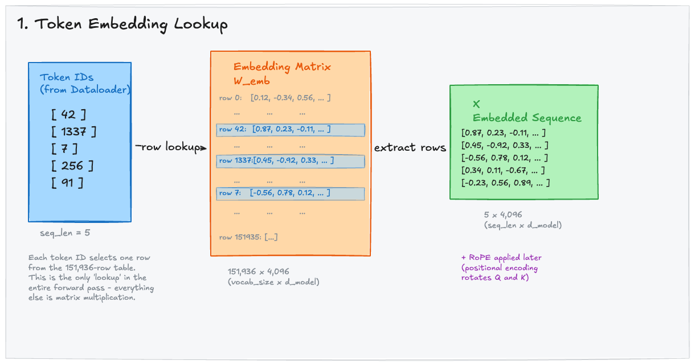

# The Embedding Layer

The embedding layer is the entry point of the forward pass. It converts discrete token IDs — integers that mean nothing to linear algebra — into dense, continuous vectors that the transformer can process through matrix multiplications.

---

## 1. Why Embeddings?

A tokenizer splits text into tokens and maps each token to an integer ID. For example:

```
"The cat sat" → ["The", " cat", " sat"] → [976, 8415, 7924]
```

These integers are arbitrary indices — the model can't do math on them directly. The embedding layer provides a **learned lookup table** that maps each token ID to a dense vector of floating-point numbers. These vectors encode semantic meaning: similar tokens end up with similar vectors after training.

---

## 2. The Embedding Matrix

The embedding layer is a single matrix `W_emb` of shape `(vocab_size, d_model)`. For Qwen3 8B:

| Dimension | Value | Meaning |
|-----------|-------|---------|
| Rows | **151,936** | One row per token in the vocabulary |
| Columns | **4,096** | The hidden dimension (d_model) |
| Total parameters | **622M** | 151,936 x 4,096 = ~622 million floats |

> **622 million parameters** just for the embedding table — that's about 7.5% of the total model parameters, and it's a simple lookup table with no computation.

<div style={{background: 'white', padding: '1rem', borderRadius: '8px', marginBottom: '1rem'}}>



</div>

*The dataloader emits token IDs (integers). Each ID selects one row from the 151,936-row embedding matrix. The result is a sequence of dense vectors — one 4,096-dimensional vector per token.*

### How the Lookup Works

The embedding lookup is **not a matrix multiplication** — it's a table index. Given a sequence of 5 token IDs `[42, 1337, 7, 256, 91]`, the embedding layer:

1. Takes row 42 from `W_emb` → a vector of 4,096 floats
2. Takes row 1337 from `W_emb` → another vector of 4,096 floats
3. Takes row 7, row 256, row 91
4. Stacks them into a matrix of shape `(5, 4096)` — that's `(seq_len, d_model)`

This is the **only lookup** in the entire forward pass. Every other operation is a matrix multiplication, element-wise operation, or normalization.

---

## 3. In PyTorch

```python
import torch
import torch.nn as nn

# Qwen3 8B embedding layer
vocab_size = 151936
d_model = 4096

embedding = nn.Embedding(vocab_size, d_model)

# Simulating what the dataloader provides
token_ids = torch.tensor([42, 1337, 7, 256, 91])  # shape: (5,)

# The forward pass through the embedding layer
x = embedding(token_ids)  # shape: (5, 4096)

print(x.shape)  # torch.Size([5, 4096])
```

Under the hood, `nn.Embedding` is essentially:

```python
# Equivalent to:
x = embedding.weight[token_ids]  # Simple row indexing
```

There's no matrix multiplication, no activation function — just selecting rows from a table. The gradient flows back through this indexing operation during backpropagation, updating only the rows that were accessed.

---

## 4. Positional Encoding: RoPE

After the embedding lookup, the model needs to know the **order** of tokens in the sequence. Without positional information, the embedding for "the cat sat on the mat" would be identical to "mat the on sat cat the" — the model wouldn't know which token comes first.

Qwen3 8B uses **Rotary Position Embeddings (RoPE)**, which work differently from the original transformer's additive positional encoding:

| Method | How it works | Used by |
|--------|-------------|---------|
| **Sinusoidal** (original) | Add fixed position vectors to embeddings | Original Transformer |
| **Learned positional** | Add learned position vectors | GPT-2 |
| **RoPE** | Rotate Q and K vectors based on position | Qwen3, Llama, Mistral |

RoPE is not applied at the embedding layer — it's applied later, inside each attention layer, to the **Query and Key vectors** only. We'll see this when we discuss the attention mechanism.

> **Key insight:** The embedding output `X` has shape `(seq_len, d_model)` but contains **no position information yet**. Position is injected later via RoPE rotations on Q and K.

---

## 5. Key Takeaways

- The embedding layer is a **lookup table**, not a neural network layer with computation.
- For Qwen3 8B, it maps 151,936 possible tokens to 4,096-dimensional vectors.
- The output shape is `(seq_len, d_model)` — this `X` matrix flows into every transformer block.
- Position information is added later via RoPE (applied to Q and K in each attention layer).
- The embedding table alone accounts for ~622M parameters (7.5% of the model).
