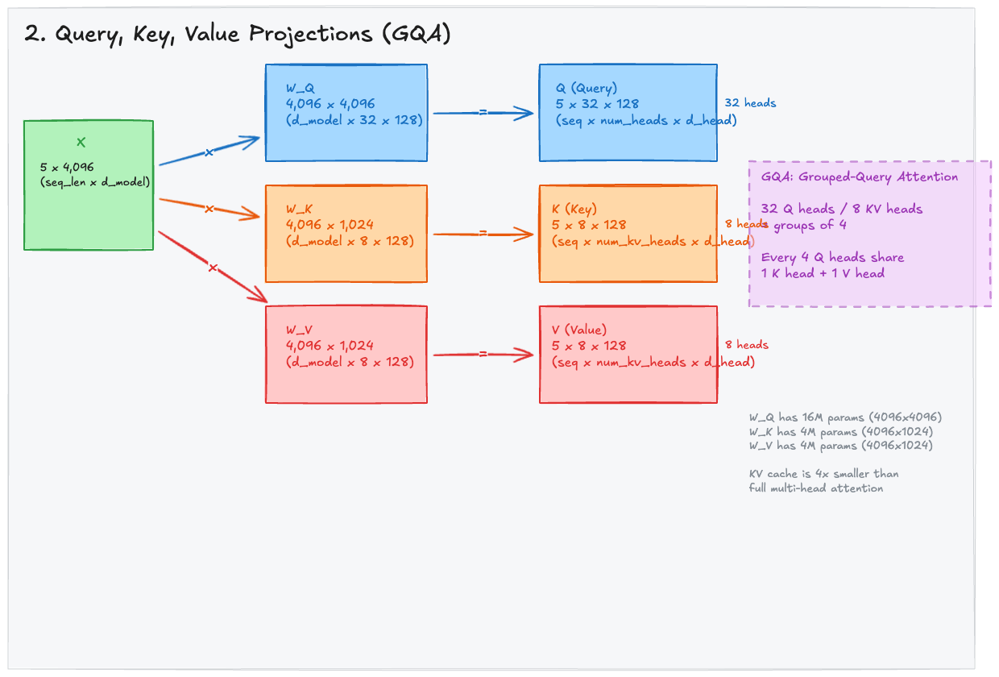

# Query, Key, Value Projections

Inside each transformer layer, the embedded sequence `X` is projected into three separate tensors — **Query (Q)**, **Key (K)**, and **Value (V)** — through learned weight matrices. These projections are the foundation of the self-attention mechanism.

---

## 1. The Information Retrieval Analogy

Self-attention is fundamentally an **information retrieval system**. The analogy maps directly to how a search engine works:

| Tensor | Question it answers | Search analogy |
|--------|-------------------|----------------|
| **Query (Q)** | "What am I looking for?" | The search query you type |
| **Key (K)** | "What do I contain?" | The index entry for each document |
| **Value (V)** | "What information do I provide if matched?" | The actual content of each document |

For every token in the sequence, the model asks: "Which other tokens are relevant to me?" It answers this by comparing each token's Query against every other token's Key. The strength of the match determines how much of each token's Value gets incorporated into the output.

---

## 2. How Q, K, V Are Computed

Each projection is a straightforward matrix multiplication:

```
Q = X . W_Q
K = X . W_K
V = X . W_V
```

Where `X` is the input hidden state (output of the previous layer, or the embedding for the first layer), and `W_Q`, `W_K`, `W_V` are learned weight matrices.

<div style={{background: 'white', padding: '1rem', borderRadius: '8px', marginBottom: '1rem'}}>



</div>

*The input `X` (5 x 4,096) is projected through three weight matrices to produce Q, K, and V. Notice that `W_Q` is 4x larger than `W_K` or `W_V` — this is because of Grouped-Query Attention (GQA).*

---

## 3. Multi-Head Attention: Why Multiple Heads?

Instead of performing one single attention computation with the full 4,096-dimensional vectors, the model splits the representation into **multiple heads** that attend independently.

For Qwen3 8B with 32 attention heads:
- Each head operates on `d_head = 128` dimensions (4,096 / 32 = 128)
- Each head can learn to detect a **different type of relationship**

Think of it like having 32 specialist analysts, each examining the data from a different angle:

| Head | Might learn to detect |
|------|---------------------|
| Head 1 | Syntactic dependencies (subject-verb agreement) |
| Head 2 | Positional proximity (nearby tokens) |
| Head 3 | Semantic similarity (related concepts) |
| Head 4 | Coreference resolution (pronouns to entities) |
| ... | ... |

After all heads compute their outputs independently, the results are concatenated and projected back to the full dimension:

```
MultiHead(X) = Concat(head_1, ..., head_32) . W_O
```

---

## 4. Grouped-Query Attention (GQA)

Qwen3 8B doesn't use standard Multi-Head Attention (MHA). It uses **Grouped-Query Attention (GQA)**, an optimization that significantly reduces memory usage during inference.

### The Three Attention Variants

| Method | Q heads | K heads | V heads | KV Cache Size |
|--------|---------|---------|---------|---------------|
| **MHA** (Multi-Head Attention) | 32 | 32 | 32 | Baseline |
| **GQA** (Grouped-Query Attention) | 32 | 8 | 8 | **4x smaller** |
| **MQA** (Multi-Query Attention) | 32 | 1 | 1 | 32x smaller |

### How GQA Works in Qwen3 8B

GQA groups the 32 Query heads into **8 groups of 4**. Each group shares a single Key head and a single Value head:

```
Group 1: Q heads 1-4   share K_1, V_1
Group 2: Q heads 5-8   share K_2, V_2
Group 3: Q heads 9-12  share K_3, V_3
...
Group 8: Q heads 29-32 share K_8, V_8
```

### Weight Matrix Dimensions

This asymmetry shows up directly in the weight matrix sizes:

| Matrix | Dimensions | Parameters | Why |
|--------|-----------|------------|-----|
| `W_Q` | 4,096 x 4,096 | **16.8M** | 32 heads x 128 d_head = 4,096 output dims |
| `W_K` | 4,096 x 1,024 | **4.2M** | 8 KV heads x 128 d_head = 1,024 output dims |
| `W_V` | 4,096 x 1,024 | **4.2M** | 8 KV heads x 128 d_head = 1,024 output dims |
| `W_O` | 4,096 x 4,096 | **16.8M** | Projects concatenated heads back |

> **W_Q is 4x larger than W_K or W_V** — this is the direct consequence of having 4x more Q heads than KV heads.

### Why GQA Matters

During **inference** (autoregressive generation), the model caches K and V tensors from all previous tokens to avoid recomputing them at each step. This is called the **KV cache**:

- **MHA KV cache**: 32 K tensors + 32 V tensors per layer per token
- **GQA KV cache**: 8 K tensors + 8 V tensors per layer per token → **4x less memory**

For a 40,960-token context in Qwen3 8B with 36 layers, GQA saves approximately **6 GB of GPU memory** compared to full MHA. This is the difference between fitting in a single GPU and needing two.

---

## 5. In PyTorch

```python
import torch
import torch.nn as nn

d_model = 4096
num_heads = 32        # Q heads
num_kv_heads = 8      # KV heads (GQA)
head_dim = 128

# The projection matrices
W_Q = nn.Linear(d_model, num_heads * head_dim, bias=False)      # 4096 -> 4096
W_K = nn.Linear(d_model, num_kv_heads * head_dim, bias=False)   # 4096 -> 1024
W_V = nn.Linear(d_model, num_kv_heads * head_dim, bias=False)   # 4096 -> 1024

# Input: batch of sequences
x = torch.randn(1, 5, d_model)  # (batch=1, seq_len=5, d_model=4096)

# Project to Q, K, V
q = W_Q(x)  # (1, 5, 4096) -> reshape to (1, 5, 32, 128)
k = W_K(x)  # (1, 5, 1024) -> reshape to (1, 5, 8, 128)
v = W_V(x)  # (1, 5, 1024) -> reshape to (1, 5, 8, 128)

# Reshape for multi-head computation
q = q.view(1, 5, num_heads, head_dim).transpose(1, 2)      # (1, 32, 5, 128)
k = k.view(1, 5, num_kv_heads, head_dim).transpose(1, 2)   # (1, 8, 5, 128)
v = v.view(1, 5, num_kv_heads, head_dim).transpose(1, 2)    # (1, 8, 5, 128)

# For GQA: repeat K and V to match the number of Q heads
# Each KV head is shared by 4 Q heads
num_groups = num_heads // num_kv_heads  # 32 / 8 = 4
k = k.repeat_interleave(num_groups, dim=1)  # (1, 32, 5, 128)
v = v.repeat_interleave(num_groups, dim=1)  # (1, 32, 5, 128)
```

> **Note:** The `repeat_interleave` for GQA is a logical expansion — efficient implementations (like FlashAttention) handle this without actually copying the data.

---

## 6. Key Takeaways

- Q, K, V are produced by three separate linear projections of the input `X`.
- **Multi-Head Attention** splits the computation into 32 independent heads, each operating on 128 dimensions.
- **GQA** in Qwen3 8B uses 32 Q heads but only 8 KV heads — every 4 Q heads share 1 K and 1 V head.
- This reduces the KV cache by 4x during inference, with minimal quality loss compared to full MHA.
- The Q projection (`W_Q`) has 4x more parameters than `W_K` or `W_V`.
