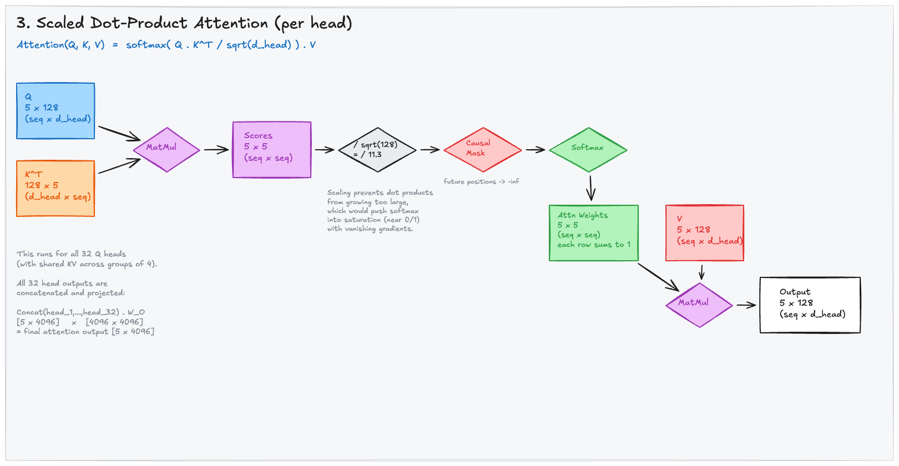

# Scaled Dot-Product Attention

With Q, K, and V in hand, we can now compute the core attention mechanism. This is where the model decides **how much each token should attend to every other token** in the sequence.

---

## 1. The Attention Formula

The entire computation fits in one line:

```
Attention(Q, K, V) = softmax(Q . K^T / sqrt(d_head)) . V
```

Let's break this down step by step, tracking the matrix dimensions through each operation. We'll trace a single attention head where `seq_len = 5` and `d_head = 128`.

<div style={{background: 'white', padding: '1rem', borderRadius: '8px', marginBottom: '1rem'}}>



</div>

*The complete attention pipeline: Q and K^T are dot-producted to get scores, scaled, masked, softmaxed, then multiplied by V to produce the output.*

---

## 2. Step-by-Step Walkthrough

### Step 1: Q . K^T (Dot Product)

```
Q:   (5, 128)   — 5 tokens, each with a 128-dim query vector
K^T: (128, 5)   — transpose of K
─────────────
Result: (5, 5)   — the attention score matrix
```

Each element `scores[i][j]` is the dot product of token `i`'s query with token `j`'s key. A higher dot product means token `i` considers token `j` more relevant.

```python
# Per-head computation
scores = torch.matmul(q, k.transpose(-2, -1))  # (5, 128) @ (128, 5) = (5, 5)
```

The resulting 5x5 matrix answers: "For each token, how relevant is every other token?"

### Step 2: Scale by sqrt(d_head)

```
Scaled Scores = Scores / sqrt(128) = Scores / 11.31
```

**Why scale?** The dot products of 128-dimensional vectors can grow large (proportional to the dimension). Large values push softmax into saturation — the output becomes nearly one-hot, gradients nearly vanish, and the model can't learn nuanced attention patterns.

Dividing by `sqrt(d_head)` keeps the variance of the scores at approximately 1, regardless of the head dimension.

```python
scores = scores / (128 ** 0.5)  # Scale by sqrt(d_head)
```

> **Intuition:** If Q and K entries are ~N(0,1), their dot product has variance `d_head`. Dividing by `sqrt(d_head)` normalizes the variance back to ~1.

### Step 3: Causal Mask

In a decoder-only model (like Qwen3 8B), each token can only attend to **itself and previous tokens** — never future tokens. This is enforced by setting future positions to `-infinity` before softmax:

```
Position:     0    1    2    3    4
Token 0:  [ ok  -inf -inf -inf -inf ]
Token 1:  [ ok   ok  -inf -inf -inf ]
Token 2:  [ ok   ok   ok  -inf -inf ]
Token 3:  [ ok   ok   ok   ok  -inf ]
Token 4:  [ ok   ok   ok   ok   ok  ]
```

After softmax, `-inf` becomes 0 — effectively zeroing out attention to future tokens.

```python
# Create causal mask (upper triangle = True)
mask = torch.triu(torch.ones(5, 5, dtype=torch.bool), diagonal=1)
scores = scores.masked_fill(mask, float('-inf'))
```

> **Why causal masking?** During training, the model processes all tokens in parallel. Without the mask, the model could "cheat" by looking at the answer when predicting it. The mask ensures the model can only use information from the past, just like during autoregressive generation.

### Step 4: Softmax

```python
attn_weights = torch.softmax(scores, dim=-1)  # (5, 5)
```

Softmax converts each row of raw scores into a **probability distribution** — every row sums to 1. Token `i`'s attention weights tell you what fraction of its "attention budget" it spends on each other token.

Example (after softmax, for token 4 attending to all 5 tokens):
```
Token 4: [0.05, 0.10, 0.15, 0.30, 0.40]  — sums to 1.0
```

This says token 4 pays 40% of its attention to itself, 30% to token 3, 15% to token 2, etc.

### Step 5: Multiply by V

```
Attention Weights: (5, 5)
V:                 (5, 128)
─────────────────
Output:            (5, 128)
```

The final step is a weighted sum of value vectors:

```python
output = torch.matmul(attn_weights, v)  # (5, 5) @ (5, 128) = (5, 128)
```

For each token, the output is a blend of all value vectors, weighted by the attention scores. Token 4's output is:

```
output[4] = 0.05 * V[0] + 0.10 * V[1] + 0.15 * V[2] + 0.30 * V[3] + 0.40 * V[4]
```

This is what makes self-attention powerful: each token's representation is **dynamically composed** from the representations of other tokens, with the composition weights learned by the model.

---

## 3. Concatenation and Output Projection

After all 32 heads compute their outputs independently, the results are concatenated and projected:

```python
# Each head produces (5, 128) output
# Concatenate all 32 heads: (5, 32 * 128) = (5, 4096)
concat = torch.cat([head_1, head_2, ..., head_32], dim=-1)

# Project back to d_model
output = W_O(concat)  # (5, 4096) @ (4096, 4096) = (5, 4096)
```

The output projection `W_O` (4,096 x 4,096 = 16.8M parameters) mixes information from all heads. Without it, each head's output would remain in its own isolated 128-dimensional subspace.

---

## 4. The Complete Attention in PyTorch

```python
import torch
import torch.nn.functional as F

def scaled_dot_product_attention(q, k, v, mask=None):
    """
    Args:
        q: (batch, num_heads, seq_len, d_head)
        k: (batch, num_heads, seq_len, d_head)
        v: (batch, num_heads, seq_len, d_head)
        mask: (seq_len, seq_len) boolean mask, True = positions to mask
    Returns:
        output: (batch, num_heads, seq_len, d_head)
    """
    d_head = q.size(-1)

    # Step 1: Q . K^T
    scores = torch.matmul(q, k.transpose(-2, -1))  # (..., seq, seq)

    # Step 2: Scale
    scores = scores / (d_head ** 0.5)

    # Step 3: Causal mask
    if mask is not None:
        scores = scores.masked_fill(mask, float('-inf'))

    # Step 4: Softmax
    attn_weights = F.softmax(scores, dim=-1)

    # Step 5: Weighted sum of V
    output = torch.matmul(attn_weights, v)  # (..., seq, d_head)

    return output
```

> **In practice**, this is replaced by `F.scaled_dot_product_attention()` (PyTorch 2.0+) which automatically selects the most efficient implementation — FlashAttention, memory-efficient attention, or the math fallback — based on your hardware and tensor shapes.

---

## 5. FlashAttention: The Practical Implementation

The naive attention described above materializes the full `(seq_len, seq_len)` attention matrix in memory. For Qwen3 8B's 40,960 token context:

```
Attention matrix: 40,960 x 40,960 x 4 bytes x 32 heads = ~215 GB per layer
```

This is clearly impractical. **FlashAttention** fuses the entire attention computation into a single GPU kernel that never materializes the full attention matrix. It processes the computation in tiles, keeping only small chunks in fast SRAM at any time.

```python
# Modern PyTorch — FlashAttention is used automatically when available
with torch.nn.attention.sdpa_kernel(torch.nn.attention.SDPBackend.FLASH_ATTENTION):
    output = F.scaled_dot_product_attention(q, k, v, is_causal=True)
```

The output is mathematically identical — FlashAttention is an optimization of the computation order, not an approximation.

---

## 6. Key Takeaways

- Attention computes a **dynamic, content-dependent weighted sum** of value vectors.
- The score matrix `Q . K^T` is `(seq_len, seq_len)` — every token scores against every other token.
- Scaling by `sqrt(d_head)` prevents softmax saturation and gradient vanishing.
- **Causal masking** ensures decoder-only models can't see future tokens during training.
- Softmax converts raw scores into a probability distribution (each row sums to 1).
- The output for each token is a **weighted blend** of all (visible) value vectors.
- FlashAttention makes this practical for long sequences by never materializing the full attention matrix.
